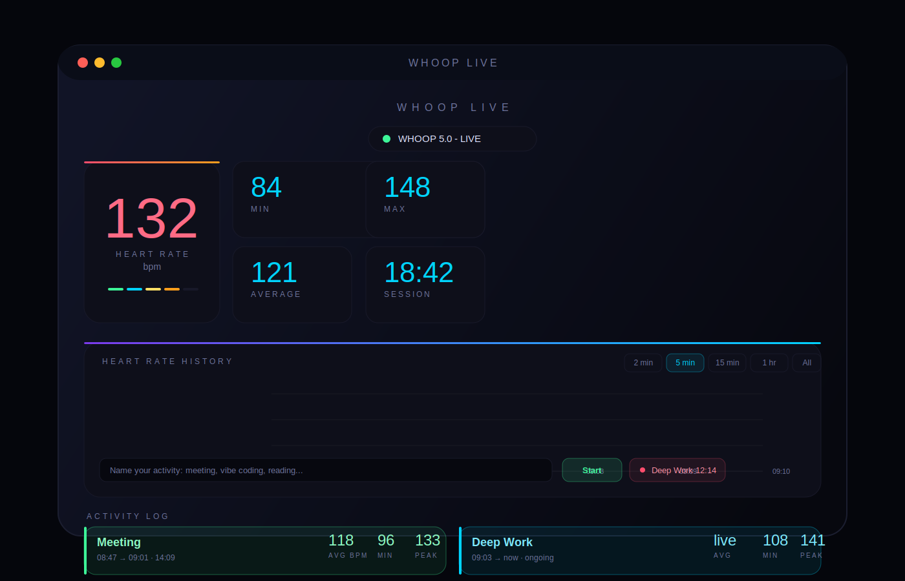

# WHOOP Live Monitor

A real-time heart rate monitor for macOS that connects directly to your WHOOP strap via Bluetooth — no login, no API, no delays.

## Preview



_Illustrative preview of the current macOS app UI._

## Features

- **Live heart rate** via Bluetooth BLE, updates every second
- **Activity tracking** — tag intervals (meeting, coding, reading) and see avg / min / peak BPM per activity
- **Heart rate history chart** with 2 min / 5 min / 15 min / 1 hr / All views
- **5 HR zones** with color coding
- **Session stats** — min, max, average, duration
- Runs as a **native macOS app** (no browser needed)

## Requirements

- macOS 11+
- Python 3.9+
- WHOOP 4.0 or 5.0 strap
- Bluetooth enabled on your Mac

## Quick Start

```bash
git clone https://github.com/YOUR_USERNAME/whoop-live.git
cd whoop-live
chmod +x run.sh
./run.sh
```

The script installs all dependencies automatically and opens the app window.
Your WHOOP strap must be worn and within Bluetooth range of your Mac.

> macOS will ask for Bluetooth permission on first launch — click OK.

## Build a standalone .app

```bash
source venv/bin/activate
python build.py
```

Output: `dist/WHOOP Live.app` — drag to `/Applications` to install.

## Activity Tracking

1. Type a label in the input field (e.g. "Deep work", "Meeting", "Reading")
2. Press **▶ Start** when the activity begins
3. Press **■ Stop** when it ends

A colored band appears on the chart for that interval, and a summary card shows avg / min / peak BPM.

## How It Works

WHOOP broadcasts heart rate over Bluetooth Low Energy (BLE) as a standard Heart Rate Monitor profile — no account or API key needed. The app uses [Bleak](https://github.com/hbldh/bleak) to connect directly to the strap.

The UI is built with Flask + Chart.js, wrapped in a native macOS window via [pywebview](https://pywebview.flowrl.com/).

## Stack

| Library | Purpose |
|---|---|
| [Bleak](https://github.com/hbldh/bleak) | Bluetooth BLE connection |
| [Flask](https://flask.palletsprojects.com/) | Local API server |
| [pywebview](https://pywebview.flowrl.com/) | Native macOS window |
| [Chart.js](https://www.chartjs.org/) | Heart rate chart |

## Notes

- Heart rate data is stored in memory only — nothing is saved to disk
- The strap must be within ~10 meters of your Mac
- Tested on macOS 13 / 14 / 15 with WHOOP 4.0 and 5.0

## License

MIT
